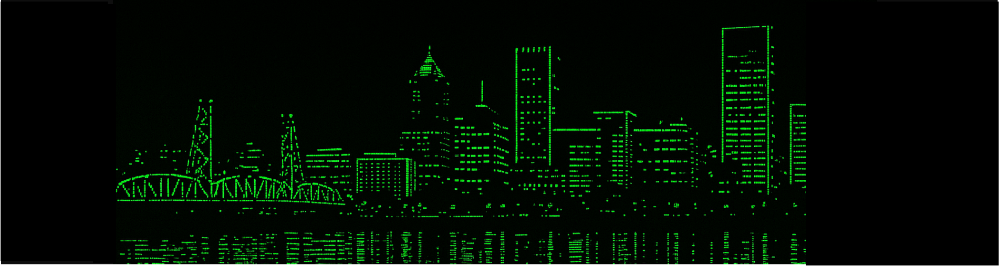

---
# Hello World! 

I'm interested in **full-stack development** and enjoy working on both the frontend and backend.
Still learning, still building, and probably still fixing something.

## Education

**Bachelor's Degree in Information and Communication Technology**  
Major: Programming - Bahrain Polytechnic

## Contact
- Email: qamarain.hasan@gmail.com

## Tech Stack
                               
